# Linkway - Social network for developers

## 1. Project introduction
Linkway is a social network where developers can come here and learn from other's knowledge through posts, 
and also share things they know about IT.

## 2. Main functions

- **Basic authentication:** login, register, forgot password, change password
- **Create post:** posts are written in [Markdown](https://www.markdownguide.org/getting-started/) 
 and will be converted to HTML to render in browser
- **Interact to other posts:** comment, upvote / downvote, reply comment, edit your comment
- **Interact with tags:** follow / unfollow, see posts of a specific tag, see all tags
- **Edit your profile**
- **Realtime chat and notifications**
- **Search for posts and users**

## 3. Technologies

### 3.1. Used technologies

**BackEnd**

- Spring boot
  - Spring security
  - Spring session
  - Spring data (JPA)
  - Spring mail

- Websocket

**FrontEnd**

- Thymeleaf + CSS + JS

**Build tool**
- Maven

### 3.2. Project structure
``` 
├── main

│   ├── java

│   │   └── com

│   │       └── social_network

│   │           ├── config

│   │           ├── controller

│   │           ├── dao

│   │           ├── dto

│   │           ├── entity

│   │           ├── exception

│   │           ├── service

│   │           ├── util

│   └── resources

│       ├── static

│       │   ├── css

│       │   ├── img

│       │   └── js

│       └── templates
```

## 4. Database: MySQL
**ERD**

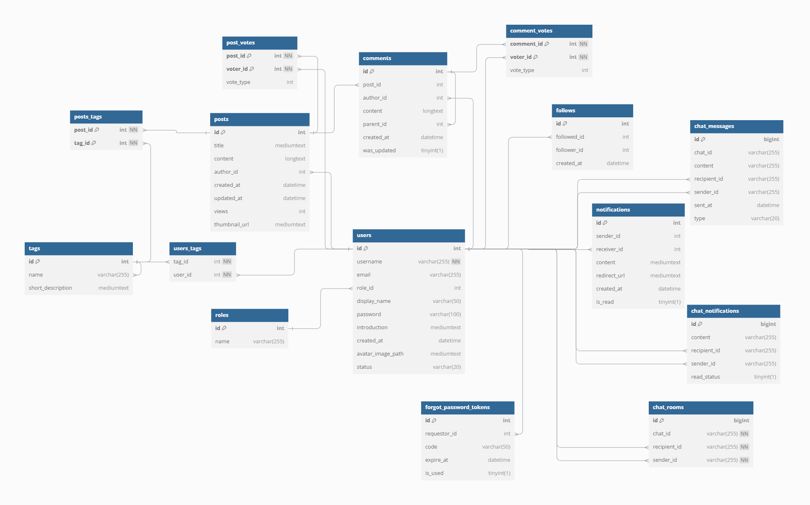

## 5. Demo images

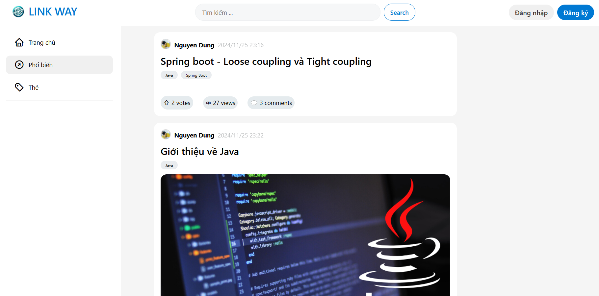
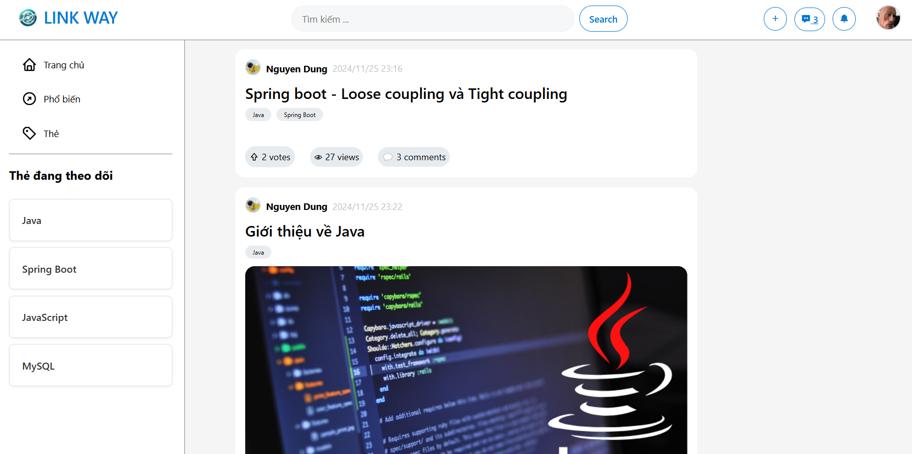
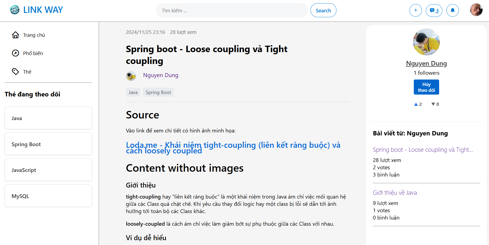
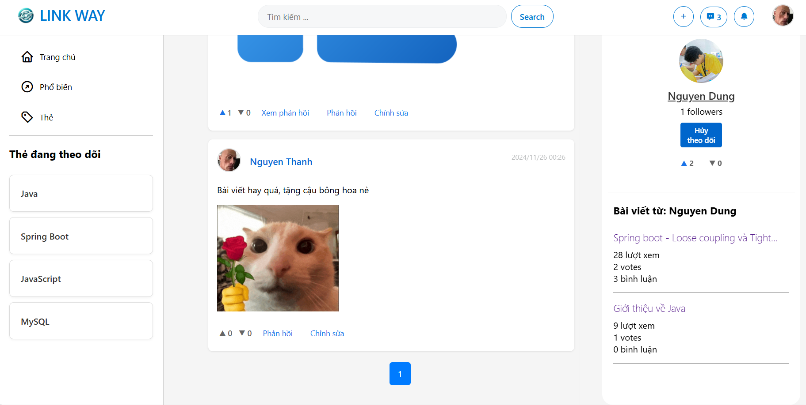
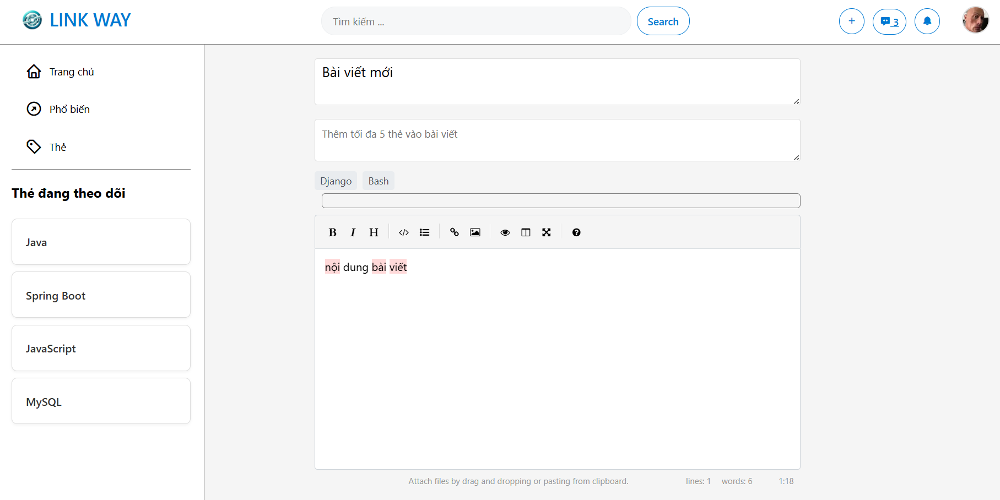
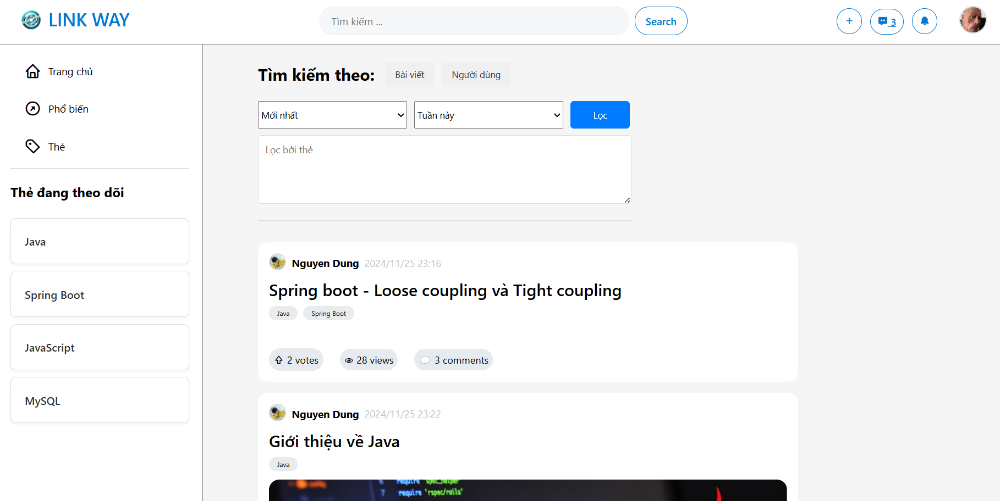
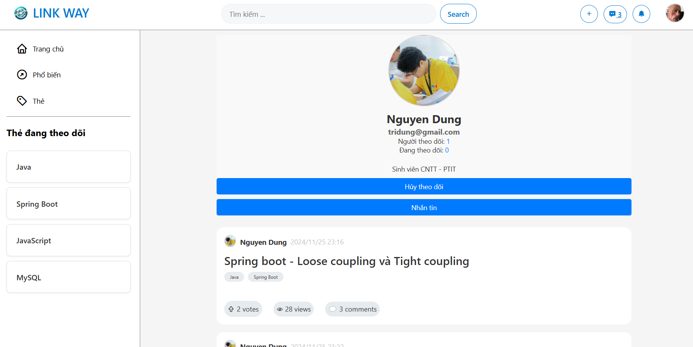
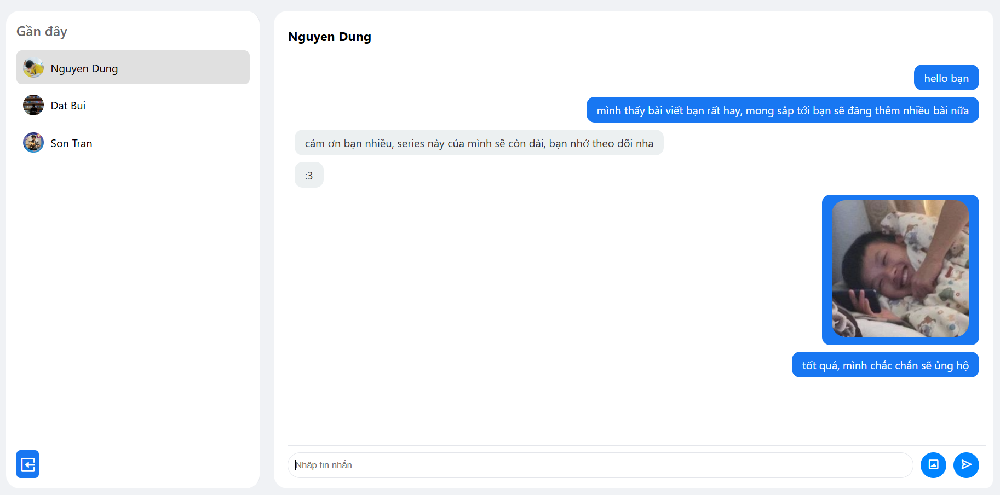
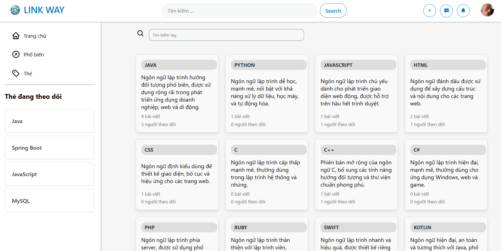
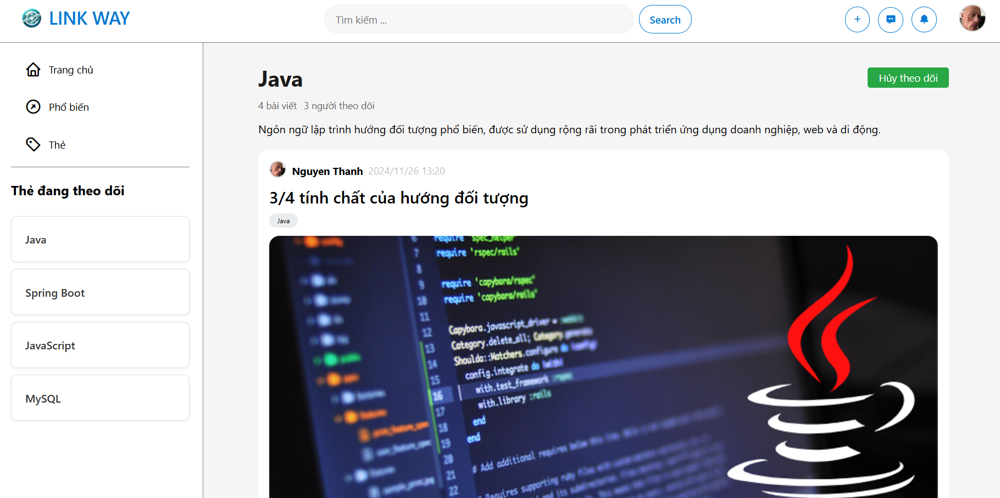
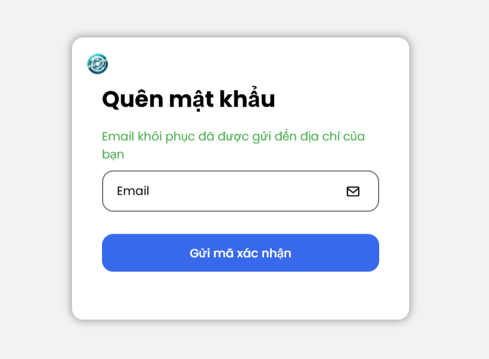

## 6. How to run

### 6.1. Prequisites

- JDK 17 or above
- Cloudinary account (to use upload image feature)
- MySQL
- Any Java IDE (recommend Intellij IDEA)

### 6.2 Config

- Create your MySQL connection and schema. And run [create_table_script](create_tables_mysql.sql) to create tables

- Fill db config in application.properties

- Create your own .env file to config Cloudinary, read more [here](https://cloudinary.com/documentation/java_integration)

- Fill your username and password in application.properties to config Spring mail for sending email in forgot password feature
  (app password, not your gmail password, read [here](https://knowledge.workspace.google.com/kb/how-to-create-app-passwords-000009237))

- Add some data into tags table

### 6.3. Enjoy 

## 7. Contributing

Pull requests are welcome. For major changes, please open an issue first to discuss what you would like to change.

